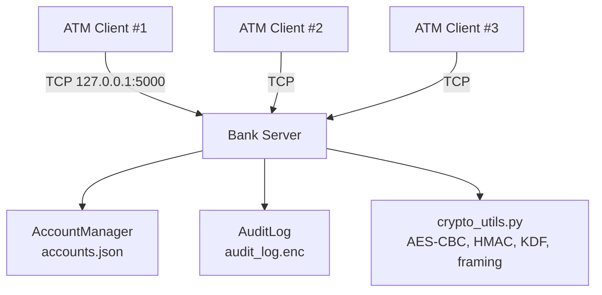
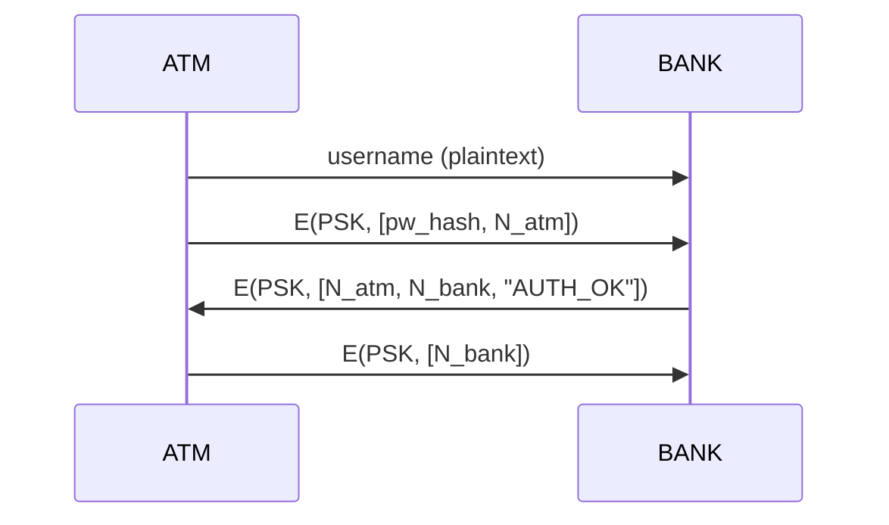
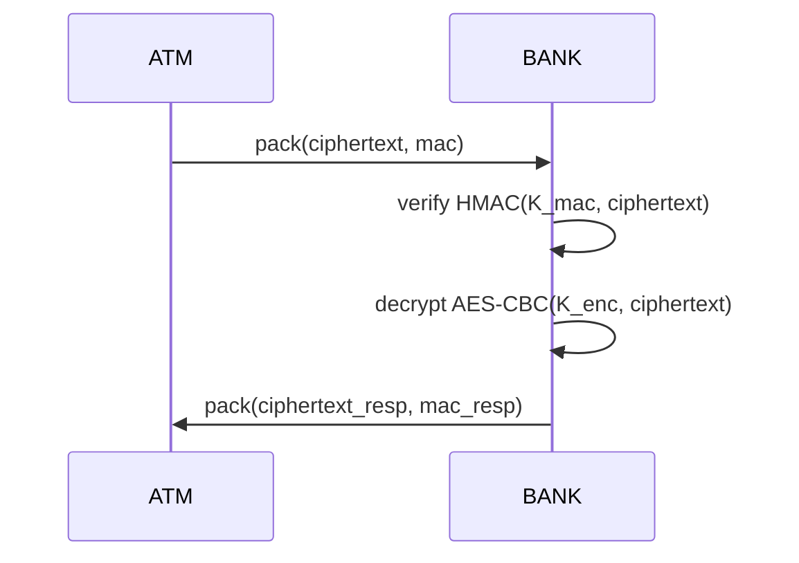

# COE817 Secure Banking System

Secure banking application for COE817 (Network Security): **1 Bank Server + up to 3 ATM Clients** with:
- 3-Step Mutual authentication (PSK + nonces)
- Session key establishment (“Master Secret”)
- Key derivation → encryption + MAC keys
- Confidential + integrity-protected transactions
- Encrypted audit logging (at rest)
- Tkinter GUIs for demo

---

## Repository Layout

```text
.
├── atm_client.py
├── bank_server.py
├── crypto_utils.py
├── accounts.json
└── docs/
    ├── architecture.md
    ├── workflows.md
    └── gallery/
```

---

## Requirements

- Python 3.10+
- pycryptodome

Install:
```bash
pip install pycryptodome
```

---

## Quick Start

### 1) Start the Bank Server
```bash
python bank_server.py
```

### 2) Start 1–3 ATM Clients
```bash
python atm_client.py
```

Default:
- Server listens on `127.0.0.1:5000`
- Each client connects over TCP

---

## Demo Accounts

Accounts and balances are stored in `accounts.json`.

| Username | Password   |
|---------:|------------|
| alice    | hello      |
| bob      | password   |
| charlie  | charlie123 |
---

## System Architecture



---

## Security Protocol Overview

### Threat Model
We assume an attacker can:
- eavesdrop on traffic (confidentiality required)
- modify traffic (integrity required)
- replay traffic (freshness required)

---

## Phase 1: Mutual Authentication + Master Secret Establishment

Each customer has a **pre-shared key (PSK)** with the bank (assumption from project spec / demo setup).



**What each value means**
- `pw_hash`: SHA-256 hash of the password (demo authentication)
- `N_atm`: fresh nonce generated by ATM/client
- `N_bank`: fresh nonce generated by bank server
- `E(PSK, ...)`: encryption under the pre-shared key between this user and the bank

**What this achieves**
- Bank authenticates customer: validates password hash for `username`
- ATM authenticates bank: bank returns correct `N_atm` encrypted under PSK
- ATM confirms to bank: returns `N_bank` encrypted under PSK
- Both sides now have fresh nonces for this session

---

## Master Secret

After mutual authentication, both sides derive a shared session secret:

- `MasterSecret = HMAC(PSK, N_atm || N_bank)`

This secret is **not sent over the network**; it is derived independently on both sides.

---

## Phase 2: Key Derivation (Encryption Key + MAC Key)

Two symmetric keys are derived from the Master Secret:
- `K_enc`: used for AES encryption
- `K_mac`: used for HMAC integrity protection

(KDF is an HKDF-like HMAC expansion implemented in `crypto_utils.py`.)

---

## Secure Transactions

All transaction requests and responses are protected using **Encrypt-then-MAC**:

- `ciphertext = AES-CBC(K_enc, plaintext)`
- `mac = HMAC-SHA256(K_mac, ciphertext)`
- Server verifies MAC **before** decrypting



### Replay Protection
Two layers are used:
1) **Timestamp freshness window** (e.g., 60 seconds)
2) **MAC replay cache** (reject duplicate MACs)

---

## Encrypted Audit Log

Every transaction produces an audit entry in the format:
- `[ CustomerID | Action | Timestamp ]`

Entries are encrypted and appended to:
- `audit_log.enc`

The server GUI supports decrypting and viewing the audit log for demo.

---

## UI Gallery

- ATM Login: `docs/gallery/atm-login.png`
- ATM Transactions: `docs/gallery/atm-transactions.png`
- Bank Server UI: `docs/gallery/server-ui.png`
- Audit Log Viewer: `docs/gallery/audit-log.png`

---

## Docs

- `docs/requirements.md` — spec checklist mapped to code
- `docs/workflows.md` — message formats, crypto, replay defenses
- `docs/architecture.md` — module breakdown + threading model
