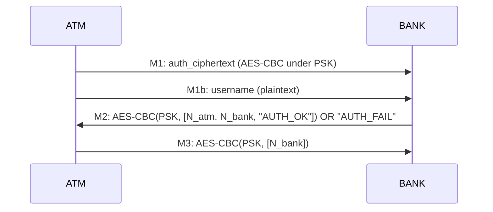

This document specifies the security workflows (protocols) implemented by the system, and how they map to the on-the-wire message formats.

---

## Notation
- `PSK_u`: pre-shared key for user `u` (client and server both know it)
- `N_atm`: nonce generated by ATM (16 bytes)
- `N_bank`: nonce generated by Bank (16 bytes)
- `MS`: Master Secret
- `K_enc`, `K_mac`: derived keys for encryption and MAC
- `E_AES(PSK, X)`: AES-CBC encryption with random IV (output = IV || ciphertext)
- `HMAC(K, X)`: HMAC-SHA256 tag of `X`
- `pack_fields(f1, f2, ...)`: length-prefixed binary encoding:
  - `[4B len][f1][4B len][f2]...`
- `send_data(payload)`: socket frame:
  - `[4B length][payload]`

---

## Phase 0: Pre-shared key assumption (demo setup)
The PDF assumes the ATM and bank already share a key. This project implements that as:

- Server-side PSK stored in `accounts.json` under `pre_shared_key` (hex).
- Client-side PSK stored in `atm_client.py` `PRE_SHARED_KEYS`.

**Constraint:** these must match for login to succeed.

---

## Phase 1: 3-step mutual authentication (PSK + nonces)

### Goal
- Bank authenticates customer (valid password)
- ATM authenticates bank (bank proves knowledge of PSK and freshness)
- Establish fresh shared nonces `N_atm`, `N_bank` for per-session MS derivation

### Message flow

### M1 — ATM → Bank (encrypted credentials + ATM nonce)
**Plaintext fields inside encryption**
- `password_hash` (utf-8 bytes)
- `N_atm` (16 bytes)

**Constructed in ATM**
- `auth_plaintext = pack_fields(password_hash, N_atm)`
- `auth_ciphertext = aes_encrypt(PSK_u, auth_plaintext)`
- send:
  1) `send_data(auth_ciphertext)`
  2) `send_data(username)`

**Processed in Bank**
- read ciphertext + username
- look up `PSK_u` from `accounts.json`
- decrypt and unpack `[password_hash, N_atm]`
- verify `password_hash`

---

### M2 — Bank → ATM (bank nonce + proof of PSK + proof of freshness)
**Plaintext fields**
- `N_atm` (echo back)
- `N_bank` (fresh 16 bytes)
- `"AUTH_OK"` (literal)

**Constructed in Bank**
- `auth_response = pack_fields(N_atm, N_bank, b"AUTH_OK")`
- `encrypted_response = aes_encrypt(PSK_u, auth_response)`
- send `send_data(encrypted_response)`
- (on failure, bank sends plaintext `b"AUTH_FAIL"`)

**Processed in ATM**
- decrypt with PSK
- verify `returned_N_atm == N_atm`
- verify `auth_status == AUTH_OK`

This is how the ATM authenticates the bank:
- only the real bank (knowing PSK) can produce a valid ciphertext that decrypts to the correct `N_atm`.

---

### M3 — ATM → Bank (ATM proves it also knows PSK)
**Plaintext fields**
- `N_bank` (echo back)

ATM encrypts it under PSK, bank decrypts and checks:
- `returned_N_bank == N_bank`

This is how the bank authenticates the ATM possession of PSK.

---

## Phase 2: Master Secret + key derivation

### Master Secret derivation
Both sides compute:
- `MS = HMAC(PSK_u, N_atm || N_bank)`  (32 bytes)

### Key derivation (HKDF-like expansion)
Both sides compute:
- `K_enc = HMAC(MS, "encryption-key")[:16]`  (AES-128 key)
- `K_mac = HMAC(MS, "mac-key")[:16]`         (HMAC key)

### Key confirmation (extra safety step in this implementation)
After deriving keys, bank sends one encrypted+MAC’d confirmation message:

- Bank → ATM: `encrypt_and_mac(K_enc, K_mac, b"KEYS_READY")`
- ATM verifies MAC and decrypts; expects plaintext `KEYS_READY`.

This confirms both sides derived the same keys.

---

## Phase 3: Secure transactions (Encrypt-then-MAC)

### Goal
For each request/response:
- confidentiality (attacker can’t read)
- integrity/authenticity (attacker can’t modify)
- replay resistance (timestamp + MAC cache)

### Request format (ATM → Bank)
**Plaintext fields**
- `action` (utf-8 bytes): `"BALANCE" | "DEPOSIT" | "WITHDRAW" | "LOGOUT"`
- `data` (utf-8 bytes): `""` or amount like `"25.00"`
- `timestamp` (8 bytes): big-endian seconds since epoch

**Construction**
1) `req_plain = pack_fields(action, data, timestamp)`
2) `ciphertext = aes_encrypt(K_enc, req_plain)`  → includes random IV
3) `mac = HMAC(K_mac, ciphertext)`
4) `protected = pack_fields(ciphertext, mac)`
5) `send_data(protected)`

### Request verification (Bank)
1) unpack `[ciphertext, mac]`
2) verify HMAC before decrypt (reject on failure)
3) replay defenses:
   - duplicate MAC check: reject if seen within TTL
   - timestamp check: reject if outside max age window (default 60s)
4) decrypt ciphertext and unpack `[action, data, timestamp]`
5) process transaction

---

### Response format (Bank → ATM)
**Plaintext fields**
- `status`: `"OK"` or `"ERROR"`
- `data`: response string (balance, new balance, error message)

**Construction**
- `resp_plain = pack_fields(status, data)`
- `resp_protected = encrypt_and_mac(K_enc, K_mac, resp_plain)`
- `send_data(resp_protected)`

ATM verifies MAC and decrypts the response.

---

## Replay protection details

### 1) Timestamp freshness window
- ATM includes a timestamp in every request.
- Bank checks it is within ±60 seconds (`verify_timestamp(..., 60)`).

### 2) Duplicate MAC cache
- Bank extracts the MAC field from the raw request and rejects duplicates within TTL (60s).
- This catches replays even if they are inside the timestamp window.

---

## Audit logging workflow (Bank)
On important events, server appends an encrypted entry to `audit_log.enc`:

- Format (plaintext): `[ customer_id | action | timestamp ]`
- Each entry encrypted using server `AUDIT_KEY` (AES-CBC with random IV)
- Stored as length-prefixed encrypted blobs in `audit_log.enc`
- Server GUI can decrypt and display all entries.

---